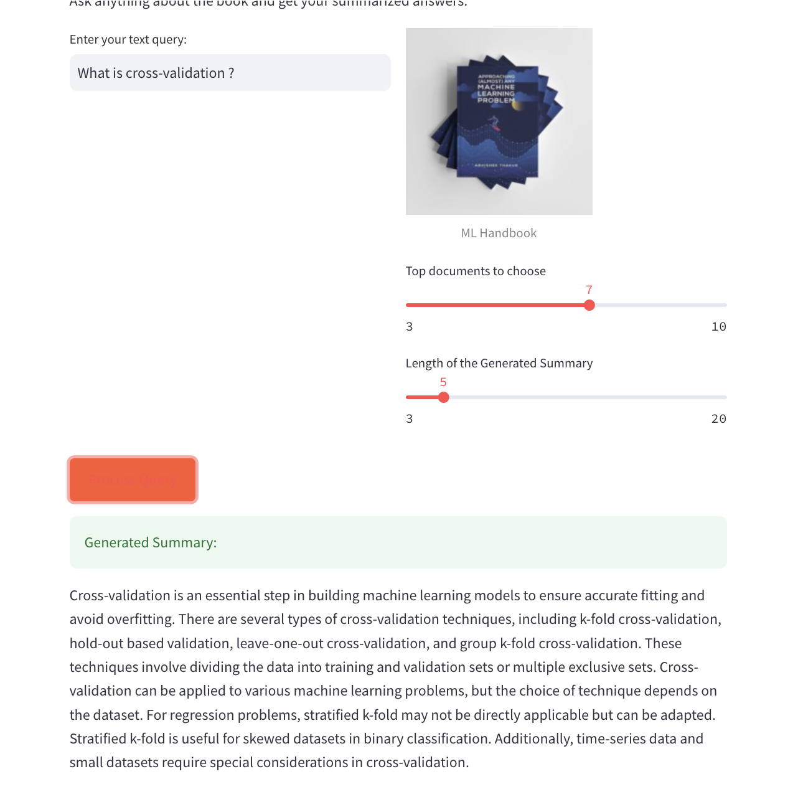

# Book Search Engine by i/oFactory

This Streamlit app allows users to ask questions about a book and receive summarized answers from a set of documents related to the book. It utilizes OpenAI's GPT-3.5 Turbo model for text generation and Faiss for efficient similarity search. Users can customize the number of top documents to consider and the length of the generated summary.

## Getting Started

To run this app, follow these steps:

1. Clone this Git repository.

2. Install the required Python packages using `pip install -r requirements.txt`.

3. Run the app using the following command:

```streamlit run app.py```

4. Enter your OpenAI API key in the app's sidebar.

5. Enter a text query about the book in the input field.

6. Adjust the sliders for the number of top documents to consider and the length of the generated summary.

8. Click the "Process Query" button to generate the summary.

## Usage

- Enter your book-related query in the provided input field.

- Use the sliders to control the number of top documents to consider and the length of the generated summary.

- Click the "Process Query" button to generate the summary.

## Snapshot of Output




